```{r setup, include=FALSE}
knitr::opts_chunk$set(
  echo = FALSE,
  warning = FALSE,
  message = FALSE
)

library(tidyverse)
library(knitr)
library(scales)

source("../config.R")

open_medic_features <- readRDS(file.path(
  "..",
  path_features
))

annee <- annee_open_medic

fmt_nb <- label_number(big.mark = " ", decimal.mark = ",", accuracy = 1)
fmt_euro <- label_number(big.mark = " ", decimal.mark = ",", accuracy = 1)

nb_obs <- nrow(open_medic_features)
nb_medicaments <- n_distinct(open_medic_features$cip13)
nb_atc5 <- n_distinct(open_medic_features$atc5)
nb_regions <- n_distinct(open_medic_features$region)

part_generiques <- open_medic_features |>
  mutate(type_generique = case_when(
      lib_top_gen == "Générique" ~ "Génériques",
      TRUE ~ "Information indisponible")) |>
  group_by(type_generique) |>
  summarise(remboursement_total = sum(remboursement, na.rm = TRUE),.groups = "drop") |>
  mutate(part = remboursement_total / sum(remboursement_total) * 100) |>
  filter(type_generique == "Génériques") |>
  pull(part)


signature_max <- open_medic_features |>
  filter(!is.na(prescripteur),!is.na(lib_atc1),prescripteur != "Inconnu",lib_atc1 != "Inconnu") |>
  group_by(prescripteur, lib_atc1) |>
  summarise(boites_total = sum(boites, na.rm = TRUE),.groups = "drop") |>
  group_by(prescripteur) |>
  mutate(part_boites = boites_total / sum(boites_total) * 100) |>
  ungroup() |>
  arrange(desc(part_boites)) |>
  slice(1)

total_boites <- sum(open_medic_features$boites, na.rm = TRUE)
total_remboursement <- sum(open_medic_features$remboursement, na.rm = TRUE)
top_remboursement <- open_medic_features |>
  group_by(lib_cip13) |>
  summarise(remboursement_total = sum(remboursement, na.rm = TRUE), .groups = "drop") |>
  arrange(desc(remboursement_total)) |>
  slice(1)

top_boites <- open_medic_features |>
  group_by(lib_cip13) |>
  summarise(boites_total = sum(boites, na.rm = TRUE), .groups = "drop") |>
  arrange(desc(boites_total)) |>
  slice(1)

top_atc <- open_medic_features |>
  group_by(lib_atc1) |>
  summarise(remboursement_total = sum(remboursement, na.rm = TRUE), .groups = "drop") |>
  arrange(desc(remboursement_total)) |>
  slice(1)

top_region <- open_medic_features |>
  group_by(region) |>
  summarise(remboursement_total = sum(remboursement, na.rm = TRUE), .groups = "drop") |>
  arrange(desc(remboursement_total)) |>
  slice(1)

top_prescripteur <- open_medic_features |>
  group_by(prescripteur) |>
  summarise(remboursement_total = sum(remboursement, na.rm = TRUE), .groups = "drop") |>
  arrange(desc(remboursement_total)) |>
  slice(1)

top_cout_boite <-
  open_medic_features |>
  group_by(lib_cip13) |>
  summarise(cout = mean(remboursement_par_boite, na.rm = TRUE),.groups = "drop") |>
  arrange(desc(cout)) |>
  slice(1)
```

<link href="https://fonts.googleapis.com/css2?family=Space+Grotesk:wght@400;500;600;700&family=Inter:wght@300;400;500;600&display=swap" rel="stylesheet">

<style>

:root {
  --bg-deep: #060b18;
  --bg-panel: rgba(18, 27, 48, 0.65);
  --bg-panel-solid: #0d1526;
  --neon-blue: #3fd3ff;
  --neon-teal: #17e9c0;
  --neon-purple: #a06bff;
  --neon-amber: #ffb84d;
  --text-main: #e8edf7;
  --text-dim: #9fb0cc;
  --grid-line: rgba(63, 211, 255, 0.06);
}

* {
  box-sizing: border-box;
}

body {
  background:
    radial-gradient(circle at 15% 10%, rgba(63, 211, 255, 0.10), transparent 40%),
    radial-gradient(circle at 85% 20%, rgba(160, 107, 255, 0.12), transparent 45%),
    radial-gradient(circle at 50% 90%, rgba(23, 233, 192, 0.08), transparent 50%),
    linear-gradient(180deg, #060b18 0%, #0a1120 40%, #0c1526 100%);
  background-attachment: fixed;
  color: var(--text-main);
  font-family: 'Inter', -apple-system, sans-serif;
  font-size: 16px;
  line-height: 1.75;
  background-image:
    linear-gradient(var(--grid-line) 1px, transparent 1px),
    linear-gradient(90deg, var(--grid-line) 1px, transparent 1px),
    radial-gradient(circle at 15% 10%, rgba(63, 211, 255, 0.10), transparent 40%),
    radial-gradient(circle at 85% 20%, rgba(160, 107, 255, 0.12), transparent 45%),
    radial-gradient(circle at 50% 90%, rgba(23, 233, 192, 0.08), transparent 50%),
    linear-gradient(180deg, #060b18 0%, #0a1120 40%, #0c1526 100%);
  background-size: 42px 42px, 42px 42px, cover, cover, cover, cover;
}

.main-container {
  max-width: 980px !important;
}

/* ---------- Typographie ---------- */

h1, h2, h3, h4 {
  font-family: 'Space Grotesk', sans-serif;
  font-weight: 700;
  letter-spacing: 0.3px;
}

h1.title {
  font-size: 2.4rem;
  background: linear-gradient(90deg, var(--neon-blue), var(--neon-teal) 45%, var(--neon-purple));
  -webkit-background-clip: text;
  background-clip: text;
  color: transparent;
  text-shadow: 0 0 40px rgba(63, 211, 255, 0.25);
}

h3.subtitle {
  color: var(--text-dim) !important;
  font-family: 'Inter', sans-serif;
  font-weight: 400;
}

.author, .date {
  color: var(--text-dim) !important;
}

h1 {
  font-size: 1.9rem;
  color: var(--text-main);
  border-bottom: 1px solid rgba(63, 211, 255, 0.25);
  padding-bottom: 10px;
  margin-top: 3.2rem;
  position: relative;
}

h1::before {
  content: "";
  position: absolute;
  left: 0;
  bottom: -1px;
  width: 90px;
  height: 2px;
  background: linear-gradient(90deg, var(--neon-blue), var(--neon-teal));
  box-shadow: 0 0 10px var(--neon-blue);
}

h2 {
  font-size: 1.25rem;
  color: var(--neon-teal);
  margin-top: 1.8rem;
}

p, li {
  color: var(--text-main);
}

strong {
  color: var(--neon-blue);
  font-weight: 600;
}

a {
  color: var(--neon-teal);
}

/* ---------- TOC flottant façon "cockpit" ---------- */

#TOC,
#TOC.tocify,
.tocify,
#TOC ul,
#TOC li,
.tocify-header,
.tocify-subheader,
.tocify-item,
#TOC .list-group,
#TOC .list-group-item,
.list-group-item {
  background: transparent !important;
  background-color: transparent !important;
  border: none !important;
  box-shadow: none !important;
  color: var(--text-main) !important;
}

#TOC {
  background: var(--bg-panel) !important;
  backdrop-filter: blur(14px);
  -webkit-backdrop-filter: blur(14px);
  border: 1px solid rgba(63, 211, 255, 0.18) !important;
  border-radius: 14px !important;
  padding: 18px !important;
  box-shadow: 0 0 30px rgba(63, 211, 255, 0.08), inset 0 0 20px rgba(63,211,255,0.03) !important;
}

#TOC .toc-content {
  color: var(--text-main) !important;
}

#TOC a,
.tocify a,
.tocify-item > a,
.tocify-header > a,
#TOC .list-group-item {
  color: var(--text-dim) !important;
  font-weight: 500;
  transition: color 0.2s ease, text-shadow 0.2s ease;
}

#TOC a:hover,
.tocify a:hover,
.tocify-item > a:hover {
  color: var(--neon-blue) !important;
  text-shadow: 0 0 8px rgba(63, 211, 255, 0.5);
}

#TOC .tocify-item.active > a,
#TOC .list-group-item.active,
#TOC .active {
  color: var(--neon-teal) !important;
  font-weight: 600;
  background: rgba(23, 233, 192, 0.08) !important;
  border-radius: 6px !important;
}

/* ---------- Cartes d'analyse (callout / insight / warning) ---------- */

.callout, .insight, .warning {
  background: var(--bg-panel);
  backdrop-filter: blur(10px);
  -webkit-backdrop-filter: blur(10px);
  padding: 20px 24px;
  margin: 24px 0;
  border-radius: 12px;
  border-left: 4px solid var(--neon-blue);
  box-shadow: 0 4px 25px rgba(0,0,0,0.35), 0 0 18px rgba(63, 211, 255, 0.07);
  position: relative;
  overflow: hidden;
}

.callout::after, .insight::after, .warning::after {
  content: "";
  position: absolute;
  top: -40%;
  right: -20%;
  width: 60%;
  height: 180%;
  background: radial-gradient(circle, rgba(255,255,255,0.03), transparent 70%);
  pointer-events: none;
}

.callout {
  border-left-color: var(--neon-blue);
}

.insight {
  border-left-color: var(--neon-teal);
}

.warning {
  border-left-color: var(--neon-amber);
}

.callout strong, .insight strong {
  color: var(--neon-teal);
}

.warning strong {
  color: var(--neon-amber);
}

/* ---------- Images / figures ---------- */

img {
  border-radius: 12px;
  box-shadow: 0 8px 30px rgba(0,0,0,0.45), 0 0 0 1px rgba(63,211,255,0.08);
}

/* ---------- Personnage BD : l'Analyste ---------- */

.bd-row {
  display: flex;
  align-items: flex-start;
  gap: 16px;
  margin: 22px 0 28px 0;
}

.bd-avatar {
  flex: 0 0 100px;   /* largeur réservée */
  width: 100px;
  height: 100px;
  border-radius: 50%;
  background: linear-gradient(145deg, #101a30, #0a1120);
  border: 2px solid var(--neon-teal);
  box-shadow: 0 0 18px rgba(23, 233, 192, 0.45), inset 0 0 10px rgba(23,233,192,0.15);

  display: flex;
  align-items: center;
  justify-content: center;

  animation: bd-float 3.2s ease-in-out infinite;
}

.bd-avatar-img{
    width:100%;
    height:100%;
    object-fit:cover;
    border-radius:50%;
}

@keyframes bd-float {
  0%, 100% { transform: translateY(0px); }
  50% { transform: translateY(-4px); }
}

.bd-bubble {
  position: relative;
  background: #101c33;
  border: 1px solid rgba(23, 233, 192, 0.35);
  border-radius: 16px;
  padding: 14px 18px;
  color: var(--text-main);
  font-size: 15px;
  line-height: 1.6;
  box-shadow: 0 6px 20px rgba(0,0,0,0.4);
  max-width: 720px;
}

.bd-bubble::before {
  content: "";
  position: absolute;
  left: -9px;
  top: 18px;
  width: 0;
  height: 0;
  border-top: 8px solid transparent;
  border-bottom: 8px solid transparent;
  border-right: 10px solid rgba(23, 233, 192, 0.35);
}

.bd-bubble::after {
  content: "";
  position: absolute;
  left: -7px;
  top: 19px;
  width: 0;
  height: 0;
  border-top: 7px solid transparent;
  border-bottom: 7px solid transparent;
  border-right: 9px solid #101c33;
}

.bd-bubble .bd-name {
  display: block;
  font-family: 'Space Grotesk', sans-serif;
  font-weight: 700;
  color: var(--neon-teal);
  font-size: 12px;
  letter-spacing: 1.2px;
  text-transform: uppercase;
  margin-bottom: 4px;
}

/* ---------- Divers ---------- */

hr {
  border-color: rgba(63,211,255,0.15);
}

::-webkit-scrollbar {
  width: 10px;
}
::-webkit-scrollbar-track {
  background: var(--bg-deep);
}
::-webkit-scrollbar-thumb {
  background: linear-gradient(180deg, var(--neon-blue), var(--neon-purple));
  border-radius: 10px;
}

</style>

<div class="bd-row">
<div class="bd-avatar">
  
</div>
<div class="bd-bubble">
<span class="bd-name">Isman · Votre Analyste</span>
Bienvenue à bord. Je vais t'accompagner tout au long de ce rapport pour pointer les résultats qui méritent le plus d'attention côté pilotage budgétaire.
</div>
</div>

# Introduction

Ce rapport présente une analyse métier des données **Open Medic AMELI `r annee`**.

L'objectif est de transformer les données de remboursement de médicaments en informations utiles pour la décision : dépenses, volumes, classes thérapeutiques, profils de consommation, régions, spécialités médicales et impact budgétaire.

<div class="callout">
<strong>Objectif du rapport :</strong> proposer une lecture claire, visuelle et opérationnelle des remboursements de médicaments en France, conçue comme un tableau de bord d'aide à la décision plutôt qu'une simple restitution statistique.
</div>

# 1. Vue d'ensemble du marché

## Question métier

Quelle est l'ampleur du marché des médicaments remboursés observé dans les données Open Medic ?

```{r}
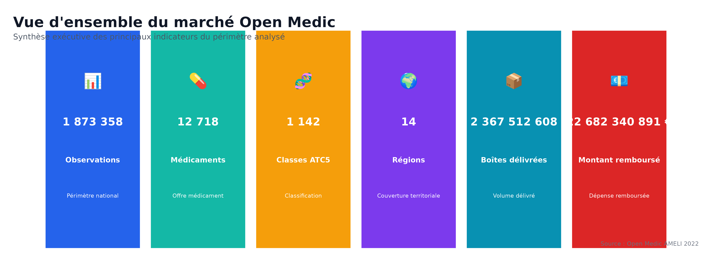
```

<div class="insight">
Le périmètre analysé est conséquent : <strong>`r fmt_nb(nb_obs)` observations</strong>, <strong>`r fmt_nb(nb_medicaments)` médicaments distincts</strong>, <strong>`r fmt_nb(nb_atc5)` classes ATC5</strong> et <strong>`r fmt_nb(nb_regions)` régions</strong>.  
Les données couvrent <strong>`r fmt_nb(total_boites)` boîtes délivrées</strong> et <strong>`r fmt_euro(total_remboursement)` € remboursés</strong>.  
Le jeu de données est donc suffisamment riche pour produire une lecture nationale des dépenses pharmaceutiques, et suffisamment granulaire pour descendre ensuite au niveau des molécules, des classes thérapeutiques et des territoires sans perdre en robustesse statistique.
</div>

<div class="bd-row">
<div class="bd-avatar">
  
</div>
<div class="bd-bubble">
<span class="bd-name">Isman</span>
Avec un volume pareil, chaque point de pourcentage sur une classe thérapeutique représente déjà des montants significatifs à l'échelle nationale. Gardons ça en tête pour la suite.
</div>
</div>

# 2. Médicaments les plus remboursés

## Question métier

Quels médicaments représentent les montants de remboursement les plus élevés ?

```{r}
knitr::include_graphics("../outputs/figures/fig_01_top20_medicaments_remboursement.png")
```

<div class="insight">
Les remboursements sont fortement concentrés sur quelques médicaments. Le médicament le plus remboursé est <strong>`r top_remboursement$lib_cip13`</strong>, avec <strong>`r fmt_euro(top_remboursement$remboursement_total)` €</strong> remboursés.  
Ces produits doivent être considérés comme prioritaires dans toute analyse de maîtrise des dépenses : un suivi rapproché de leur évolution (volumes, prix, alternatives thérapeutiques ou génériques disponibles) peut avoir un effet de levier disproportionné sur la dépense globale.
</div>

# 3. Médicaments les plus délivrés

## Question métier

Quels médicaments sont les plus consommés en nombre de boîtes ?

```{r}
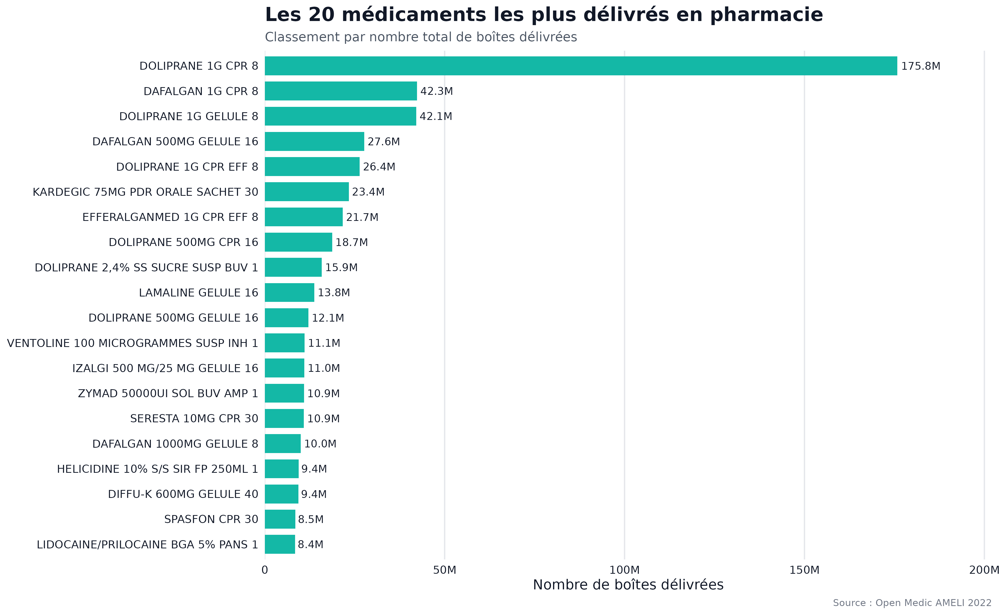
```

<div class="insight">
Le médicament le plus délivré est <strong>`r top_boites$lib_cip13`</strong>, avec <strong>`r fmt_nb(top_boites$boites_total)` boîtes</strong>.  
Cela montre que les médicaments les plus consommés ne sont pas nécessairement ceux qui coûtent le plus à l'Assurance Maladie : le volume traduit surtout la fréquence d'usage dans la population, tandis que le poids budgétaire dépend davantage du prix unitaire et de la structure du marché.
</div>

# 4. Remboursement versus volume

## Question métier

Les médicaments les plus remboursés sont-ils aussi les plus délivrés ?

```{r}
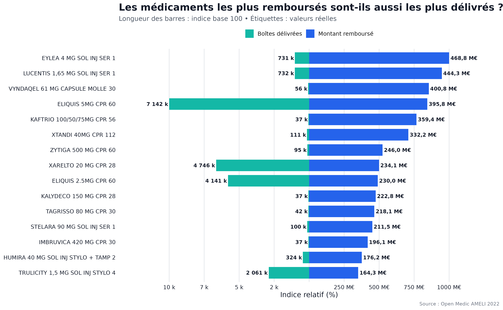
```

<div class="insight">

La comparaison met en évidence que le volume de consommation et le montant remboursé ne sont pas systématiquement liés.<br>

Certains médicaments combinent un volume élevé et un poids budgétaire important, tandis que d'autres présentent un coût élevé malgré un nombre limité de boîtes délivrées.<br>

Cette distinction est essentielle pour identifier les médicaments ayant le plus fort impact économique sur l'Assurance Maladie, et pour distinguer deux leviers d'action bien différents : la maîtrise des volumes (pertinence des prescriptions) et la maîtrise du coût unitaire (négociation de prix, recours aux génériques ou biosimilaires).

</div>

<div class="bd-row">
<div class="bd-avatar">
  
</div>
<div class="bd-bubble">
<span class="bd-name">Isman</span>
C'est exactement ce genre de croisement qui permet de ne pas confondre "on en prescrit beaucoup" avec "ça coûte cher". Deux problèmes, deux leviers d'action différents.
</div>
</div>

# 5. Classes thérapeutiques

## Question métier

Quelles classes thérapeutiques concentrent les remboursements ?

```{r}
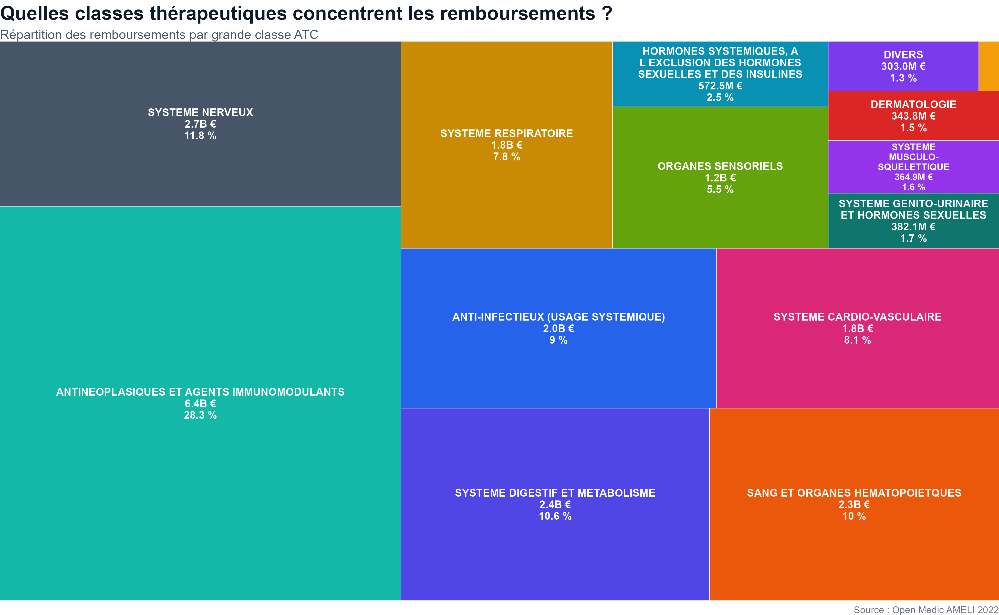
```

<div class="insight">

La classe thérapeutique qui concentre le plus de remboursements est
<strong>`r top_atc$lib_atc1`</strong>,
avec un montant total de
<strong>`r fmt_euro(top_atc$remboursement_total)` €</strong>.

Cette concentration permet d'identifier les familles thérapeutiques ayant le plus fort impact économique sur l'Assurance Maladie, et constitue un point d'entrée naturel pour toute politique de régulation ciblée : agir sur une seule classe dominante peut avoir plus d'effet que des mesures transversales diluées sur l'ensemble du marché.

</div>

# 6. Médicaments génériques

## Question métier

Quelle est la place des médicaments génériques dans les remboursements ?

```{r}
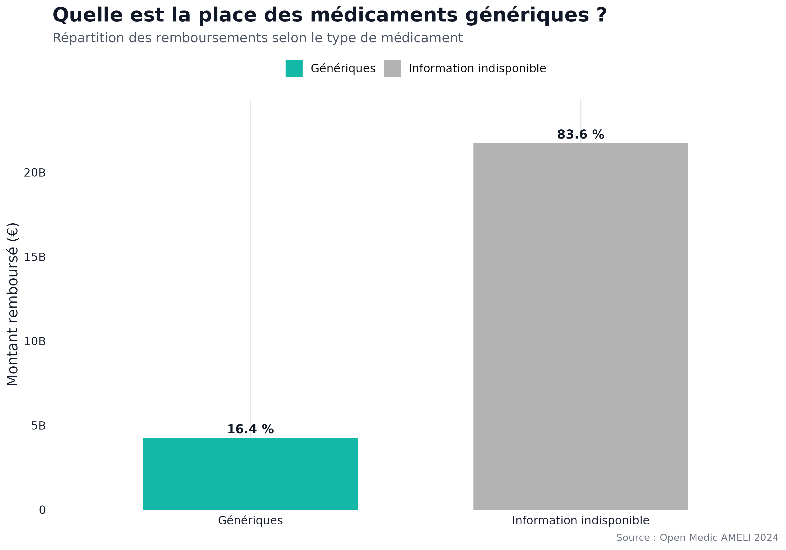
```

<div class="insight">
Les médicaments identifiés comme génériques représentent environ
<strong>`r round(part_generiques, 1)` %</strong>
du montant total remboursé.

La majorité des remboursements se situe dans la catégorie
<strong>information indisponible</strong>, ce qui invite à interpréter cette analyse avec prudence : la part réelle des génériques est probablement sous-estimée ou surestimée selon la qualité de l'information de codification, et un travail de fiabilisation de cette donnée serait un prérequis avant toute conclusion opérationnelle ferme sur la politique de substitution générique.
</div>

# 7. Analyse âge et sexe

## Question métier

Comment les remboursements se répartissent-ils selon l'âge et le sexe ?

```{r}
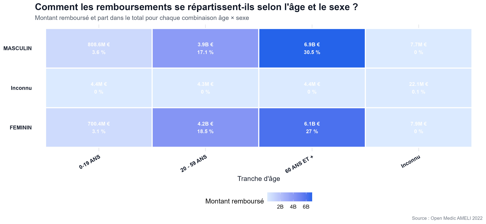
```

<div class="insight">
Les remboursements augmentent globalement avec l'âge.<br>
Le graphique permet également de comparer les profils masculins et féminins afin d'identifier d'éventuelles différences de consommation ou de coût des traitements. Cette lecture par tranche d'âge est particulièrement utile pour anticiper la trajectoire de la dépense à mesure que la pyramide des âges de la population évolue, et pour cibler des actions de prévention ou de bon usage du médicament sur les classes d'âge les plus concernées.
</div>

# 8. Profil de prescription par spécialité médicale

## Question métier

Les différentes spécialités médicales prescrivent-elles les mêmes familles de médicaments ?

```{r}
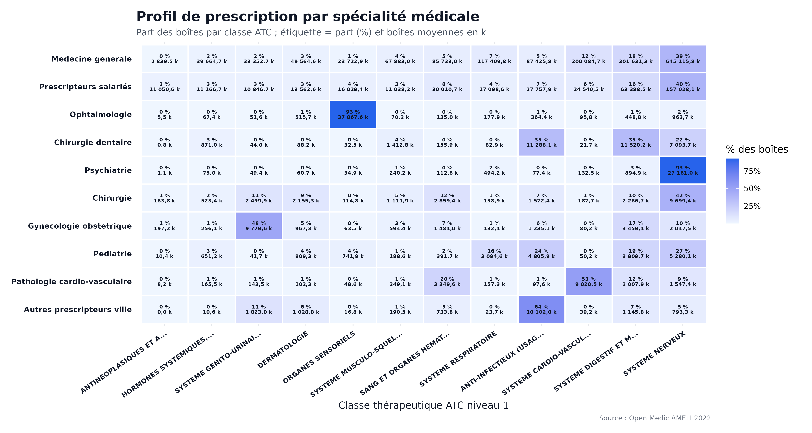
```
<div class="insight">

Cette visualisation met en évidence la spécialisation thérapeutique des principales spécialités médicales.

La concentration la plus forte est observée chez
<strong>`r signature_max$prescripteur`</strong>,
pour laquelle
<strong>`r round(signature_max$part_boites,1)` %</strong>
des boîtes prescrites appartiennent à la classe thérapeutique
<strong>`r signature_max$lib_atc1`</strong>.

Cette combinaison représente un volume total d'environ
<strong>`r scales::label_number(big.mark = " ", decimal.mark = ",", accuracy = 0.1)(signature_max$boites_total/1000)` k boîtes</strong>
dans les données Open Medic de l'année `r annee_open_medic`.

Une telle signature de prescription est un indicateur utile pour cibler des actions de sensibilisation, des recommandations de bon usage ou des échanges confraternels auprès des spécialités les plus concernées par une classe thérapeutique donnée.

</div>

<div class="bd-row">
<div class="bd-avatar">
  
</div>
<div class="bd-bubble">
<span class="bd-name">Isman</span>
Une signature de prescription aussi marquée, c'est un signal fort : ça veut dire qu'un message ciblé sur cette spécialité peut toucher une part importante des volumes concernés, sans avoir à s'adresser à tout le monde.
</div>
</div>

# 9. Analyse territoriale

## Question métier

Les dépenses sont-elles réparties de manière homogène entre les régions ?

```{r}
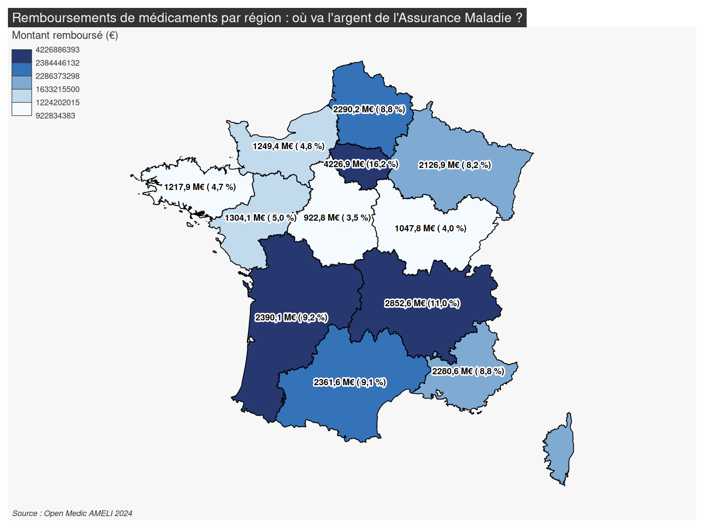
```

<div class="insight">
La région qui concentre le plus de remboursements est <strong>`r top_region$region`</strong>, avec <strong>`r fmt_euro(top_region$remboursement_total)` €</strong>.  
Ces écarts doivent toutefois être interprétés avec prudence, car ils reflètent aussi la taille de population régionale : une comparaison rapportée à la population ou standardisée par âge serait nécessaire pour transformer ce constat brut en un véritable indicateur de pilotage territorial.
</div>

# 10. Spécialités médicales

## Question métier

Quelles spécialités médicales génèrent les plus forts remboursements ?

```{r}
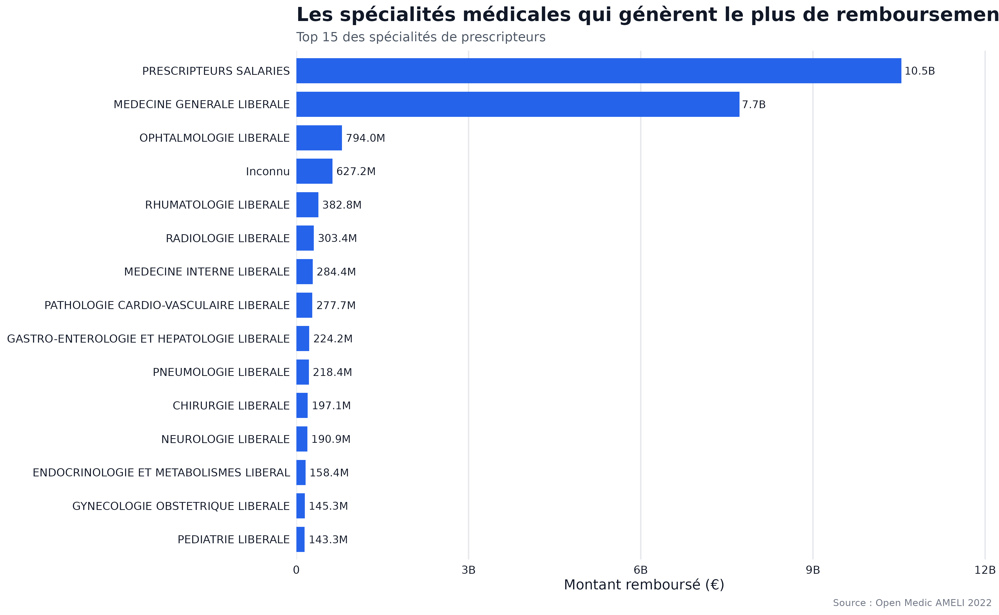
```

<div class="insight">
La spécialité de prescripteur qui concentre le plus de remboursements est <strong>`r top_prescripteur$prescripteur`</strong>, avec <strong>`r fmt_euro(top_prescripteur$remboursement_total)` €</strong>.  
Cela permet d'identifier les canaux de prescription les plus contributifs au remboursement total, et donc les interlocuteurs prioritaires pour toute démarche de dialogue, d'accompagnement ou de sensibilisation aux enjeux de maîtrise médicalisée des dépenses.
</div>

# 11. Concentration des remboursements

## Question métier

Les remboursements sont-ils concentrés sur une faible proportion de médicaments ?

```{r}
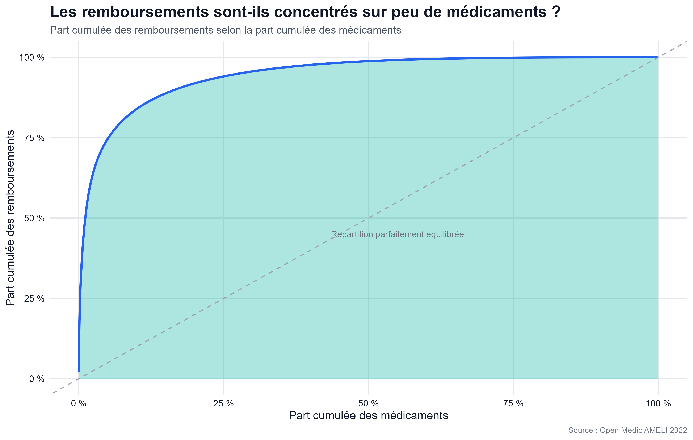
```

<div class="insight">
La courbe montre une forte concentration des remboursements : une faible proportion de médicaments explique une grande partie des dépenses.  
Pour un décideur, cela signifie que le suivi prioritaire d'un nombre limité de médicaments peut permettre de mieux piloter une part importante du budget, selon une logique proche d'une analyse de type Pareto appliquée aux dépenses pharmaceutiques.
</div>

<div class="bd-row">
<div class="bd-avatar">
  
</div>
<div class="bd-bubble">
<span class="bd-name">Isman</span>
C'est le genre de courbe que j'aime bien montrer en comité de pilotage : elle dit clairement "surveillez ce petit groupe de médicaments en priorité", plutôt que de disperser l'effort sur des milliers de références.
</div>
</div>

# 12. Impact budgétaire

## Question métier

Quels médicaments présentent un impact budgétaire élevé ?

```{r}
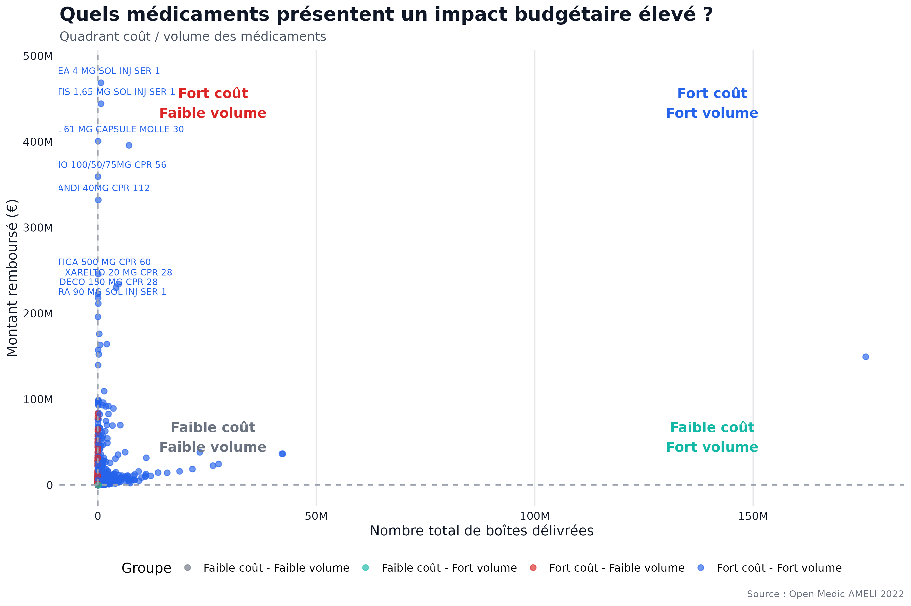
```

<div class="insight">
Le quadrant coût-volume distingue quatre profils de médicaments. Les traitements situés en haut à gauche sont particulièrement sensibles : ils génèrent de forts remboursements malgré un faible volume.  
Ce sont des médicaments à surveiller en priorité dans une logique de pilotage budgétaire, car une variation même modeste de leur prix ou de leur volume de prescription peut avoir un effet démultiplié sur la dépense totale.
</div>

# 13. Niveaux d'impact budgétaire

## Question métier

Quelle part des observations présente un impact budgétaire faible, moyen, fort ou critique ?

```{r}
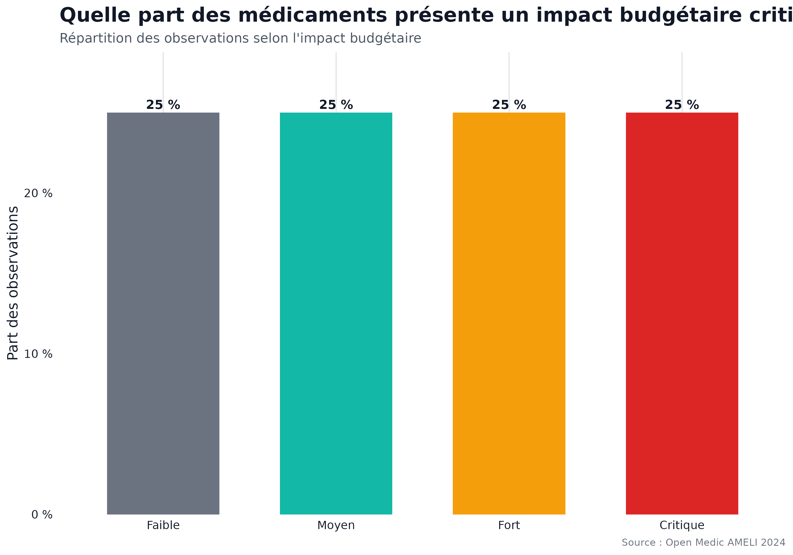
```

<div class="insight">
La répartition en quatre niveaux d'impact budgétaire est équilibrée car elle repose sur des quartiles.  
Cette classification est utile pour segmenter le portefeuille de médicaments et prioriser les analyses : faible, moyen, fort ou critique, offrant une grille de lecture simple à partager avec des équipes non techniques pour orienter les priorités d'action.
</div>

# 14. Coût moyen par boîte

## Question métier

Quels médicaments présentent le remboursement moyen par boîte le plus élevé ?

```{r}
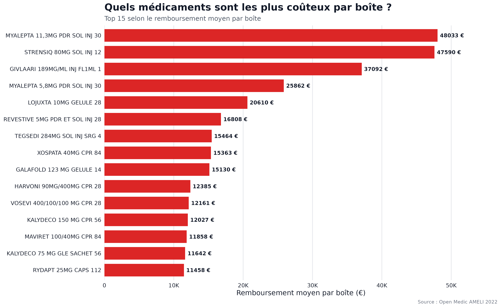
```

<div class="insight">

Les médicaments présentant le remboursement moyen par boîte le plus élevé correspondent généralement à des traitements spécialisés, inIsmannts ou destinés à des pathologies rares.<br>

Cette analyse permet d'identifier les produits dont le coût unitaire est particulièrement élevé, indépendamment de leur volume de délivrance, et complète ainsi utilement les analyses en volume : un médicament peu prescrit mais très coûteux à l'unité mérite un suivi spécifique, distinct de celui des médicaments à fort volume.

</div>

# Synthèse des enseignements

Cette analyse met en évidence plusieurs enseignements clés :

- Les dépenses de médicaments sont fortement concentrées sur un nombre limité de produits.
- Les médicaments les plus délivrés ne sont pas forcément les plus coûteux.
- Les classes thérapeutiques liées aux traitements lourds concentrent une part importante des remboursements.
- Les remboursements augmentent fortement avec l'âge.
- Les différences territoriales existent, mais doivent être analysées en tenant compte de la population régionale.
- Les médicaments à fort coût et faible volume doivent être suivis en priorité.

<div class="callout">
<strong>Message clé :</strong> le pilotage des dépenses pharmaceutiques nécessite de distinguer volume de consommation, coût unitaire, classe thérapeutique et impact budgétaire. Ces quatre dimensions, croisées entre elles, forment une grille de lecture opérationnelle bien plus riche que chacune prise isolément.
</div>

<div class="bd-row">
<div class="bd-avatar">
  
</div>
<div class="bd-bubble">
<span class="bd-name">Isman</span>
Si je devais retenir une seule idée de tout ce rapport : ne jamais piloter sur un seul indicateur. Volume, coût, classe et territoire racontent chacun une partie différente de l'histoire.
</div>
</div>

# Limites de l'analyse

<div class="warning">
Cette analyse repose sur des données agrégées. Elle ne permet pas d'analyser les trajectoires individuelles des patients ni les prescriptions au niveau patient.  
Certaines variables présentent également des modalités inconnues ou indisponibles, notamment pour l'analyse des génériques.  
Enfin, les comparaisons régionales doivent être complétées par des indicateurs rapportés à la population pour éviter une lecture uniquement liée à la taille des régions.
</div>

# Conclusion

Les données Open Medic permettent de produire une lecture riche et opérationnelle des remboursements de médicaments en France.

L'analyse met en évidence que les dépenses de l'Assurance Maladie résultent à la fois du volume de médicaments délivrés et du coût unitaire des traitements.

Le médicament présentant actuellement le coût moyen par boîte le plus élevé est **`r top_cout_boite$lib_cip13`**, ce qui illustre l'intérêt de distinguer les médicaments à fort volume de ceux présentant un coût unitaire élevé.

Ces résultats constituent une base d'aide à la décision pour identifier les médicaments, les classes thérapeutiques et les populations ayant le plus fort impact budgétaire.

<div class="callout">
<strong>Ouverture :</strong><br>

Cette étude constitue une première étape dans la compréhension des remboursements de médicaments en France. Elle fait émerger plusieurs pistes d'investigation, notamment sur les médicaments à fort impact budgétaire, les disparités territoriales et les classes thérapeutiques les plus contributrices, qui pourront faire l'objet d'analyses complémentaires.
</div>

<div class="bd-row">
<div class="bd-avatar">
  
</div>
<div class="bd-bubble">
<span class="bd-name">Isman</span>
Merci d'avoir suivi cette exploration avec moi. La prochaine étape la plus utile serait sans doute de croiser ces constats avec une dimension temporelle, pour voir comment ces équilibres évoluent d'une année sur l'autre.
</div>
</div>
